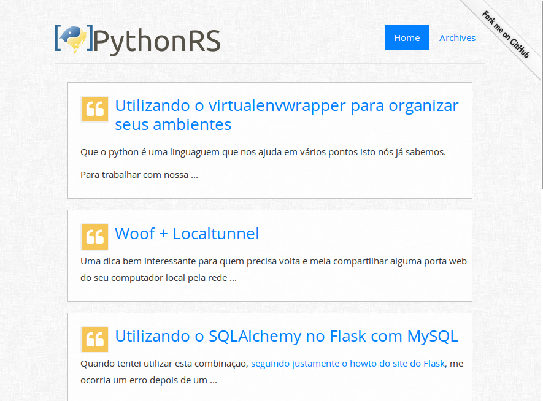

Bootstrap Simple Plus
=====================

This is a simple bootstrap pelican theme based on bootstrap [Narrow jumbotron](http://getbootstrap.com/examples/jumbotron-narrow/) template

Was updated by Sérgio Berlotto, based on [simple-bootstrap] theme.

Configuration
-------------

**GITHUB_URL** - For the Github image

**SITELOGO** - Path to the image os Logo, if null, the simple site title will be show.

Screenshot
----------

 

Live Example
------------

See the site running this template at: [pythonrs.org]

[simple-bootstrap]: https://github.com/getpelican/pelican-themes/tree/master/simple-bootstrap
[pythonrs.org]: http://pythonrs.org